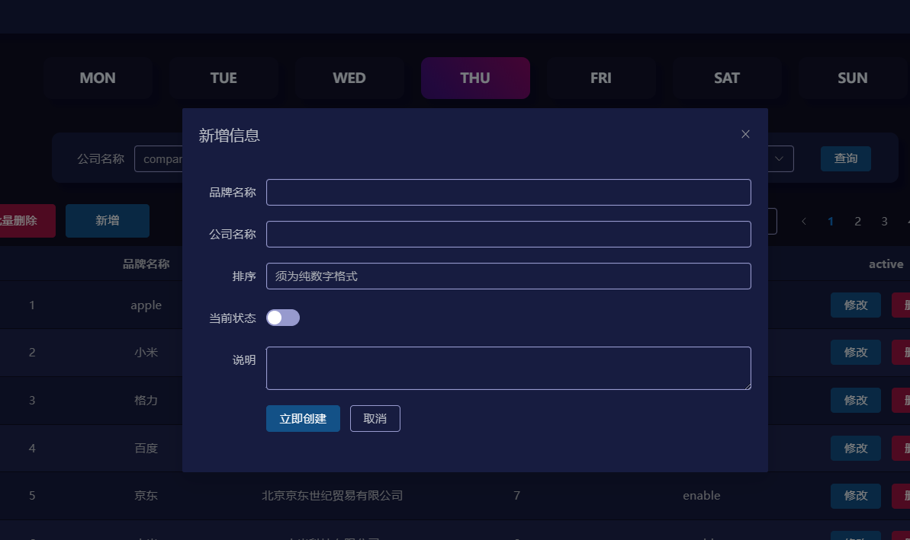

# 前后端分离的全栈项目

## 使用技术

- 前端使用 Vue3 框架，使用 axios、element-plus、router。
- 后端使用Java语言， ssm 框架。
- 使用 JWT 进行授权与信息交换。

## 前端功能

- 登录注册页，采用滑动过渡选择注册还是登录。
- 主页，也采用了滑动过渡效果。
- 通过 vue-router 的线程守卫，实现访问权限的限制。

## 进入主页前

### 过渡方面

三次效果分别使用了三种方法实现。

1. 通过 js 查询选择器，移除选择器或是添加选择器，选择器对应不同的效果，进而达到滑动登录 / 注册。
2. CSS 设置 animation 属性，设置对应的动画。
3. 使用 vue 的 v-show 标签，根据条件展示不同的效果，不排除存在频繁切换的情况，因而没有使用 v-if 。

### 数据校验

- 若提供数据不满足设定条件，则禁止提交到后端，并返回对应的警告提示，待数据满足条件、方可提交。
- 登录时会向后端请求获取 token，若token过期，将返回一个新的token，否则使用未过期的token，不进行重新获取。
- 后续进入主页后，涉及到访问数据的一切请求，全部需要进行token校验，若无法通过token校验，则返回数据为null。此工作在后端完成。
- 若登录失败会显示是邮箱问题还是密码问题。
- 

### 记住密码

- 若用户选择——记住我，则将保存用户的邮箱和密码，这将存储在 `localStorage`中，而非Cookie中。
- 若用户取消勾选，则删除其中所保存的数据。

## 进入主页后

### 星期显示

显示当日对应的星期，对应的星期较与其他日将有一个鲜明的对比背景，且此背景为 动态 渐变 效果。

### MIS

### 用户

- 在鼠标悬浮在头像上时，会有阴影效果，且会显示一个菜单栏，第一项为用户名，用户不同，用户名固然也不同。
- 第二项为切换用户，切换后会退出登录，且会移除先前登录时注册的token并返回到登录页。
- 在登录后是禁止访问登录页的，若想访问登录页，必须点击切换用户。