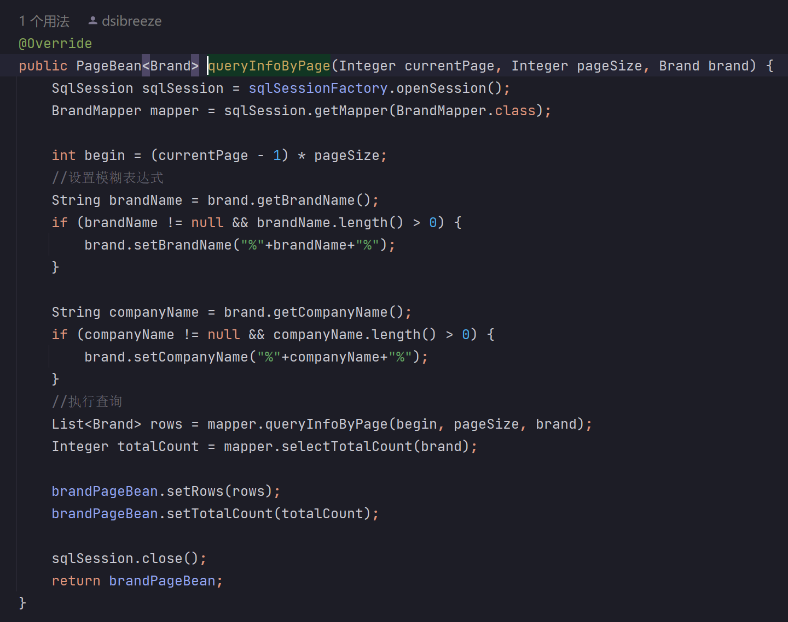

# 前后端分离的全栈项目

## 使用技术

- 前端使用 Vue3 框架，使用 axios、element-plus、router。
- 后端使用Java语言， ssm 框架。
- 使用 JWT 进行授权与信息交换。

## 后端功能

- 进行底层数据的操作，除登录注册外，均须进行token验证，否则返回数据为 null。
- 对于登录注册页，若账户密码正确，发放正确的token。

## 项目结构

### controller

即控制器，他控制数据的接收、返回、查验工作。

### javaConfig

spring注解配置类，负责依赖注入。

### mapper

myBatis 的映射类。

### model

- 像pojo一样，包含项目所需的对象，包含setter、getter、和toStirng。
- Brand属性：id，品牌名，公司名，排序，说明，状态。
- PageBean的属性：总查询行数、每一行的数据。
- Result的属性：给前端的回馈信息以及发放的token。
- User属性：用户的 id、名字、邮箱、密码。

### Service

- 包含两个服务功能接口，用户登录与MIS的相关事宜。
- 实现类在此包下的 impl 包中。

### utils

- JWT相关事宜：创建token、验证token、解析token，其中还可设置token相关属性，密钥和过期时间。
- sqlsession工厂。

### resource

1. spring XML配置文件
2. Spring MVC配置文件
3. myBatis 配置文件

## 以下为部分代码

